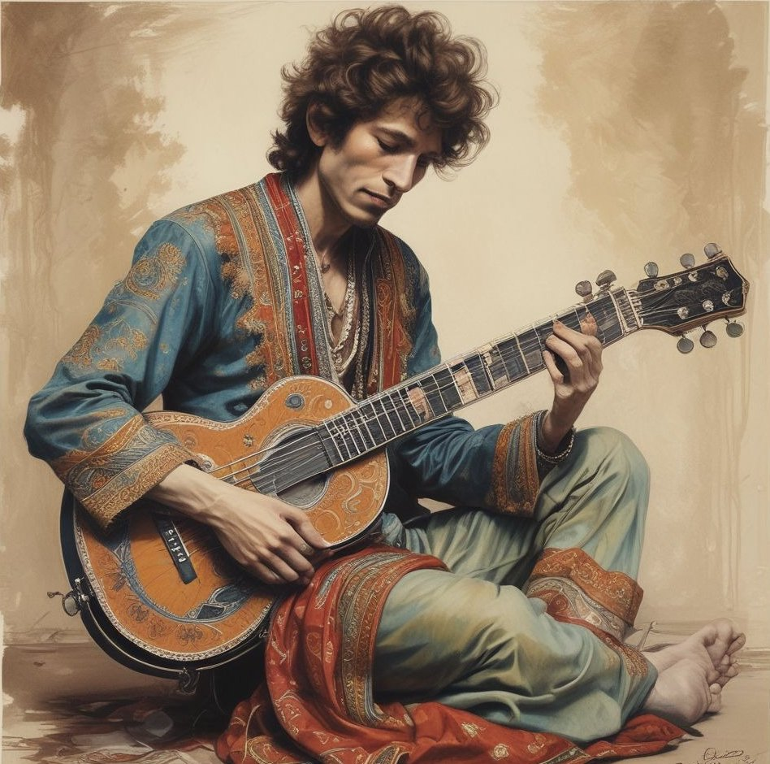

[separator=::]
= _Shining here within_
:author: Baba Dhillon
:leveloffset:
:sectnums:
:sectlinks:
:chapter-signifier:
:toc: left
:toclevels: 4
:imagesdir: ./

[.text-center]
====
How many times must a man seek in vain, +
For joy, in a world steeped in pain? +
How many lies must echo in his head, +
Before his precious body lies dead?

How many births before he can see, +
That he is neither the body nor the mind? +
When will he let go, and simply Be, +
Awareness, free of ego unkind? +

The answer, my Friend, +
Is shining Here within, +
The answer is shining Here within.
====
